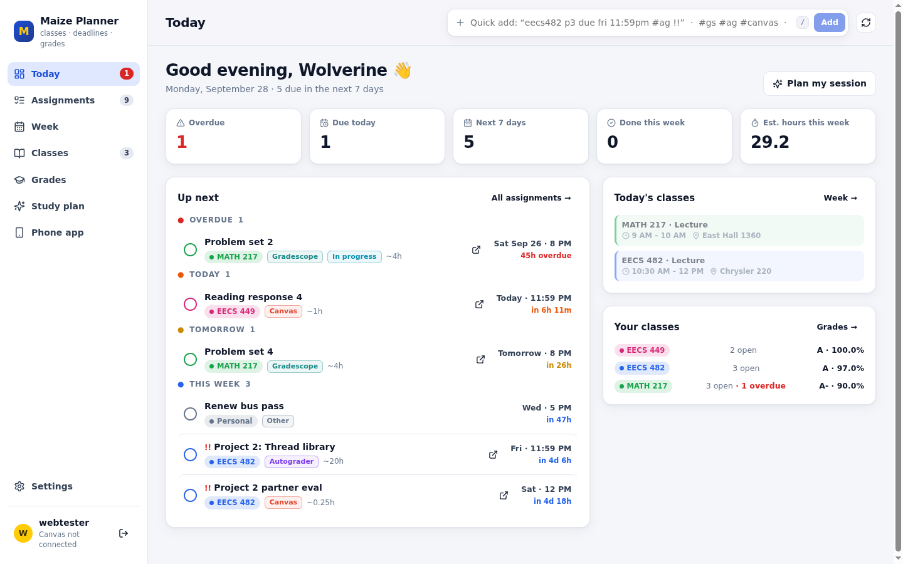
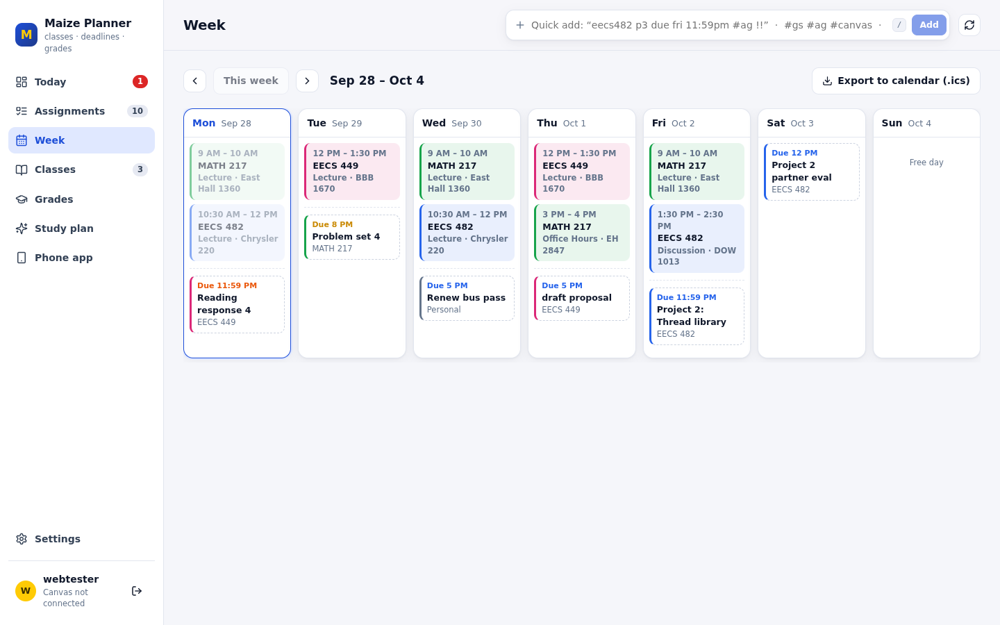
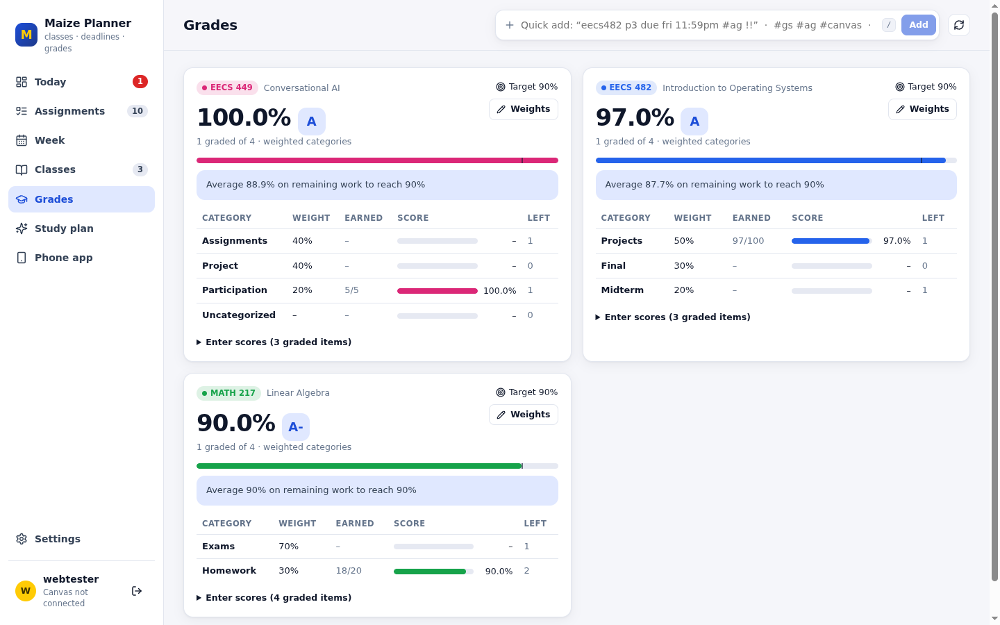
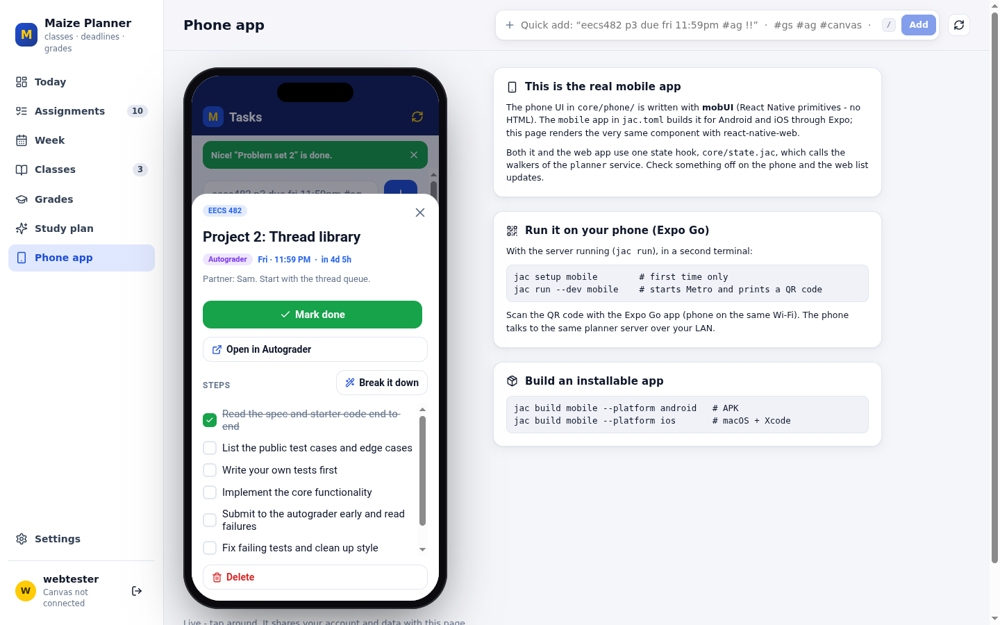

# Maize Planner

**Name:** Parin Raizada  **UMID:** 27479921

A personal planner for a university student, built entirely in [Jac](https://jaclang.org). It puts
every **Canvas**, **Gradescope** and **Autograder.io** deadline, your **class schedule** and your
**grades** in one place, on the **web**, your **phone** and your **terminal**, all backed by one Jac server.



## Features

- **Canvas sync.** Paste your Canvas calendar feed link and the planner imports your courses and every
  assignment with its due date and link. Where your school lets students make an access token, a token
  also brings in points, assignment-group **grade weights**, your submission status and your **grades**. Assignments that are really submitted on **Gradescope** (LTI tools) or
  **autograder.io** (linked in the description) are detected and tagged. Re-syncing updates items
  in place and never duplicates them.
- **Natural-language quick add**, on every client:
  `eecs482 project 3 due fri 11:59pm #ag !!` → course EECS 482, due Friday 11:59 PM, source Autograder, high priority.
  It understands `today / tonight / tomorrow / fri / next wed / in 3 days / 10/5 / oct 12 noon`,
  `#gs #ag #canvas`, `!`/`!!`/`~` priority, and `20 pts`.
- **Classes**: code, name, color, weekly meetings (lecture / discussion / lab / office hours with
  rooms), and one-click links to each course's Canvas, Gradescope, Autograder and website.
- **Today dashboard**: overdue / today / tomorrow / this week, today's classes (past / now /
  upcoming), your next class, and stats (hours of estimated work due this week, done this week).
- **Week view**: a 7-day grid of class meetings and deadlines. Browse weeks, or **export all
  deadlines to an `.ics`** file (with 24-hour reminders) for Google/Apple/Outlook calendars.
- **Grades**: live weighted grade per course (or total points if there are no weights), a
  per-category breakdown, and **"what average you need on the remaining work to hit your target"**.
  Enter scores inline, or let Canvas sync fill them in.
- **Assignment detail**: status (to do / in progress / done), priority, estimate, notes, link, score,
  and a **step checklist**. "Break it down" writes the steps for you.
- **AI study plan**: tell it how many hours you have (and optionally a goal). It picks which
  assignments to work on, in what order and for how long, then lays the blocks out on the clock
  **around your class meetings**. It uses an LLM via Jac's `by llm()` when an API key is set, and
  otherwise a built-in urgency heuristic, so the feature always works.
- **Accounts**: every user gets their own private graph. One account works on web, phone and CLI.
- **Demo semester**: one click loads 3 classes and 12 assignments, so you can try everything without Canvas.

| Week | Grades | Phone |
|---|---|---|
|  |  |  |

## Prerequisites

- **Jac 0.37.21** (pinned in `jac.toml`) with the `jac` CLI on your PATH. See the
  [Jac docs](https://jaclang.org/docs/latest) for installation. Node/Bun and Postgres are managed
  by Jac itself: the first run installs the npm packages and starts an embedded database.
- Optional, for **AI** plans and breakdowns: one of `ANTHROPIC_API_KEY`, `OPENAI_API_KEY` or
  `GEMINI_API_KEY` in the environment before `jac run`. (Override the model with `PLANNER_AI_MODEL`.)
- Optional, for the **mobile app on a real phone**: the **Expo Go** app, on the same Wi-Fi as your computer.

## Run it (web + server)

From the repository root:

```bash
jac run
```

Open **http://localhost:8000**, create an account, then either click **Load demo semester** or go to
**Settings → Canvas** and paste your calendar feed link (Canvas → **Calendar** → **Calendar Feed** at the
bottom right; UMich doesn't let students create access tokens, so this is the way in there) and hit
**Save & sync now**. If your school does allow tokens, paste one (Canvas → Account → Settings →
**+ New Access Token**) for grades and weights too.

The first run takes a minute or two while Jac installs packages and compiles. If port 8000 is
busy, Jac picks the next free one and prints it. (`jac run --port 8080` also works.)

Useful keys: press **/** anywhere to jump to quick add.

## Hosting it (GitHub Pages + a hosted server)

The web UI is published to GitHub Pages as static files; the Jac server runs on a separate host
that the UI calls over HTTPS.

1. **Database.** Create a free Postgres database (e.g. on [Neon](https://neon.tech)) and copy its
   connection URL. Jac's Postgres client can't do TLS, which Neon requires, so the container runs
   a small local proxy (`deploy/pg_tls_proxy.py`) that adds it; the URL's `?sslmode=...` part is
   ignored. For a database reached over a private network without TLS, set `PG_TLS_PROXY=0`.
2. **Server.** On [Render](https://render.com): **New → Blueprint**, pick this repo (it reads
   `render.yaml` and builds the `Dockerfile`), and paste the database URL into `JAC_DB_URL`.
   Optionally add `ANTHROPIC_API_KEY` for AI plans. Note the service URL, e.g.
   `https://maize-planner.onrender.com`. (Free Render services sleep when idle, so the first request
   after a while takes ~1 minute.)
3. **Pages.** In the GitHub repo: **Settings → Pages → Source: GitHub Actions**, then
   **Settings → Secrets and variables → Actions → Variables → New variable** named
   `PLANNER_API_URL` set to the server URL from step 2.
4. Push to `main` (or run the **Deploy web UI to GitHub Pages** workflow by hand). The site appears
   at `https://<user>.github.io/<repo>/`.

The CLI and phone app work against the hosted server too: `planner login --server <server URL>`.

## Mobile app

The phone UI (`core/phone/`, written with Jac's mobUI, i.e. React Native primitives) can be used three ways:

1. **Inside the website (no setup).** Open the **Phone app** tab. It renders the *same component* the
   native app ships, live and signed in to your account. Tick something off on the phone and the web
   view updates instantly.
2. **On your phone with Expo Go.** Keep `jac run` going, and in a second terminal:
   ```bash
   jac setup mobile       # one-time: scaffolds the Expo project in .jac/mobile-rn
   jac run --dev mobile   # starts Metro + a planner API on your LAN IP, prints a QR code
   ```
   Scan the QR code with Expo Go and sign in with the same account. The dev command starts a planner
   backend on your LAN address (it prints `API : http://<your-ip>:<port>`). That backend uses the same
   project database as `jac run`, so the phone, web and CLI all see the same data. On WSL or a VPN,
   set `JAC_RN_DEV_HOST=<ip your phone can reach>` if the auto-detected address is wrong.
3. **Installable build:** `jac build mobile --platform android` (APK) or `--platform ios` (macOS + Xcode).

## CLI

The CLI talks to the running server over Jac's typed bridge. From the repository root:

```bash
alias planner="jac run cli --"        # optional, saves typing

planner login                         # asks for username/password; --server URL if not localhost:8000
planner today                         # overdue, due soon, today's classes
planner add "eecs482 p3 due fri 11:59pm #ag !!"
planner add "Lab report" -c eecs449 -d "tomorrow 3pm" --points 10 --hours 2
planner ls                            # open work with 6-char ids   (-c COURSE, -s SOURCE, -q TEXT, --done, --all, --json)
planner done 3fa2c1                   # also: undo, start; several ids at once; any unique prefix works
planner show 3fa2 / step 3fa2 2 / breakdown 3fa2 / score 3fa2 18 --of 20 / open 3fa2 / rm 3fa2
planner week [--next 1]               # schedule + deadlines
planner courses / grades              # classes, weighted grades, needed average
planner plan --hours 3 --goal "midterm prep"
planner sync                          # Canvas import (feed or token is set once in the web Settings page)
planner ics -o planner.ics            # calendar export
planner demo / whoami / logout
```

The token is stored in `~/.config/maize-planner/config.json` (mode 600). `PLANNER_SERVER` and
`PLANNER_TOKEN` override it. Exit codes: `0` ok, `1` failed, `2` usage, `3` server unreachable,
`4` not signed in. Colors switch off automatically when piped (or with `--no-color` / `NO_COLOR`).

## How the four components fit together

```
                     ┌──────────────────────────────────────────┐
  CLI  (cli/) ──────►│  planner service  (core/planner.jac)     │
  typed bridge, HTTP │  [apps.planner] kind = "service"          │
                     │  authenticated walkers = the whole API    │
  Web  (web/) ──────►│  per-user graph:                          │
  colocated in       │   root → Profile                          │
  `jac run`          │        → Course → Meeting                 │
                     │                 → Assignment              │
  Phone (core/phone) │        → Assignment (personal)            │
  via core/state.jac►│  + Canvas client, grade math, byLLM AI    │
                     └──────────────────────────────────────────┘
```

- **Server.** `core/planner.jac` is a Jac **service app**. Its authenticated walkers (`get_dashboard`,
  `list_assignments`, `quick_add`, `sync_canvas`, `study_plan`, …) are the entire API, and each one runs
  on the caller's own root, so users are isolated. They return typed view objects (`core/views.jac`)
  with dates already formatted, so every client shows identical labels. Pure logic lives in
  `core/logic.jac` (dates, NL parsing, grades), `core/canvas.jac` (REST + parsing) and
  `core/advisor.jac` (AI + heuristics), and is unit-tested.
- **Web** (`web/`) is a `web-app`. `jac run` serves it and colocates the planner service in the same process.
- **Phone** (`core/phone/`, entry `mobile/main.jac`) is a `mobile` app in mobUI. It and the web app share
  **one state hook, `core/state.jac`** (session, data, every action), so a feature added there appears on
  both UIs. Views in the same page broadcast changes to each other, and every client polls every 30 s,
  so edits from the CLI show up too.
- **CLI** (`cli/`) is a `cli` app. `import from core.planner { quick_add, … }` compiles to typed async
  bridge stubs that call the same walkers over HTTP with your token.

## What makes it stand out

- **One Jac codebase, four apps, one graph.** No hand-written REST client anywhere: web, phone and CLI all
  call walkers directly, and the compiler generates the wire code and typed objects.
- **Built for this workflow.** It separates Canvas / Gradescope / Autograder, detects them automatically
  from Canvas, and gives autograder-specific advice ("submit early, the hidden tests tell you what to fix").
- **Grade intelligence**: weighted grades from Canvas assignment groups, plus the average you need to hit your target.
- **AI that degrades gracefully**: `by llm()` with typed `sem`-annotated outputs, validated against real
  assignment ids and laid out around your schedule. Without a key, the same UI uses the heuristic planner.
- **The real mobile app runs inside the website**, so it can be tried with no device.
- **Tested**: `jac test` runs 64 tests (date/NL parsing, grade math, Canvas parsing against realistic API
  payloads, plan layout, MockLLM-driven AI path, CLI rendering). `jac check` type-checks all four apps.

## Development

```bash
jac check          # type-check every app in the workspace
jac test           # 64 unit tests
jac run --show     # what each app runs
```

Layout: `core/` (service, logic, Canvas, AI, shared state, phone UI), `web/` (browser UI),
`mobile/` (native entry), `cli/` (terminal client), `docs/` (screenshots).

## Troubleshooting

- **"Your session expired"** after deleting `.jac/`: sign in again (the JWT secret is regenerated).
- **CLI says it can't reach the server**: make sure `jac run` is running, and that `planner login --server`
  points at the URL it printed.
- **Canvas 401**: generate a new token. UMich tokens can expire.
